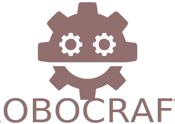

    

<h2>
https://bresilla.github.io/robocraft/
</h2></a>

  
  
  
  
  

general-purpose robotics building blocks framework

RoboCraft is a cutting-edge robotics framework engineered to expedite the creation, deployment, and management of robotic systems. With a comprehensive suite of tools, libraries, and APIs, RoboCraft enables developers to effortlessly design, prototype, and scale robotic applications across diverse industries. From autonomous vehicles to industrial automation, RoboCraft revolutionizes robotics development, driving forward the frontiers of innovation.

  ** RoboCraft is still in super early stages **  

