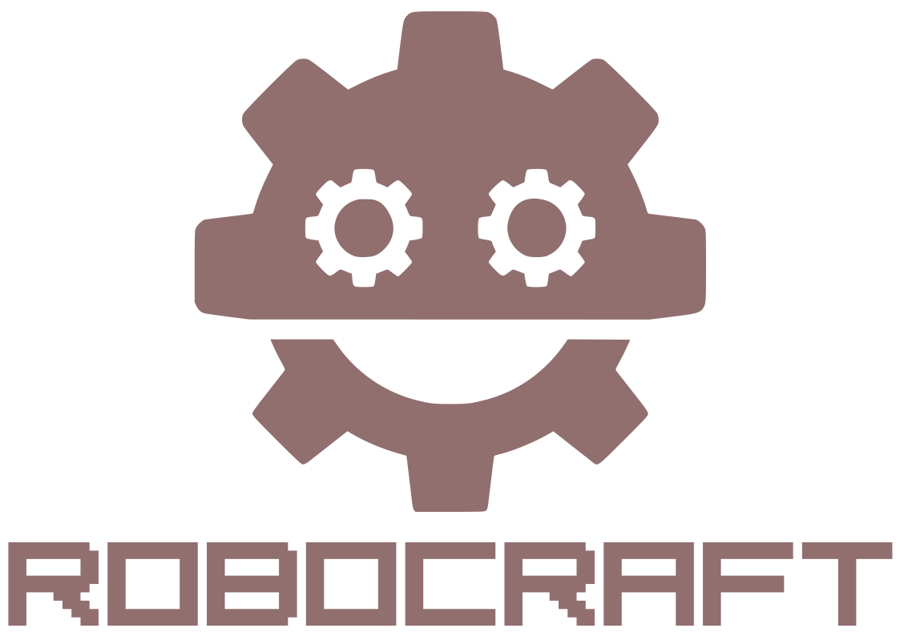

  

# ROBOCRAFT

## Introduction

Robocraft is a framework for building robots developed in Rust using:

- **Arrow** as the data interchange format within the same machine. 
- **Zenoh** as the data interchange format between machines.
- **Parquet** as the data storage format.
- **Rerun** to visualize streams of multimodal data.
- **Tracing** for event based diagnostics.